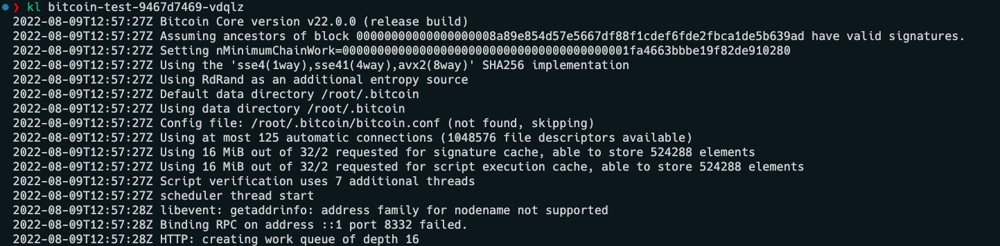

# Readme
## Building the docker image

```bash
./build-docker.sh
```

## Running the docker image

```bash
./run-docker.sh
```

## Vulnerability Scans

```bash
./grype-vulnarabilities.sh
```

## Pushing the docker image to docker hub

```bash
./push-docker.sh
```

## Creating k8s chart for bitcoin

```bash
./helm create bitcoin
```

- modify the values.yaml to reference the nbontha/bitcointest image
- setup resources etc ..

## Installing the chart to local docker desktop

```bash
./helm-install.sh
```


## Verifying the install using kubectl

```bash
kubectl get pods
```

## Viewing the logs of  the bitcoin container

```bash
./kubectl logs bitcoin-test-5f95655c97-7kwzq
```


